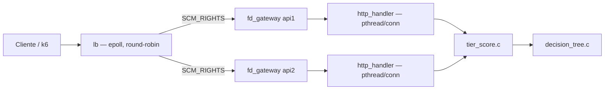
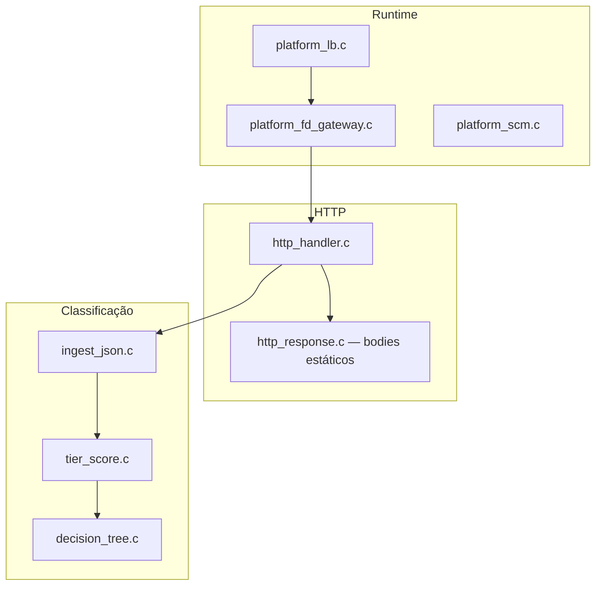
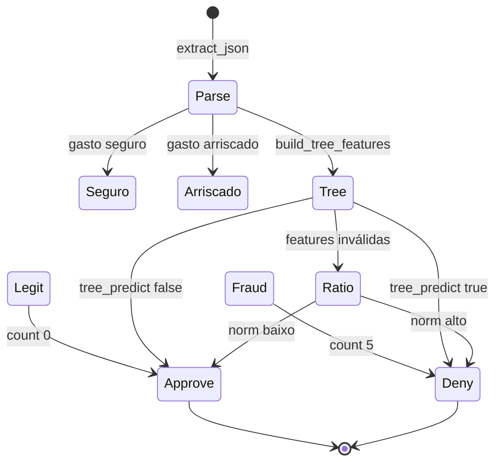
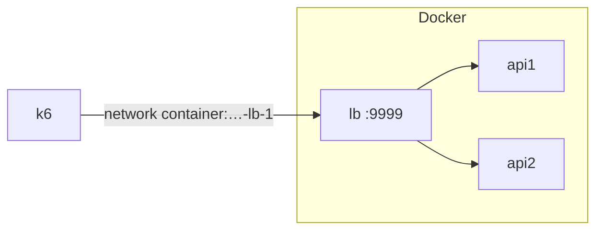

# Rinha 2026 — versão C (C11)

Implementação **C** da mesma arquitetura da versão **Rust**:

| Repositório | Stack |
|-------------|--------|
| **Rust** — [github.com/sl4ureano/rinha2026](https://github.com/sl4ureano/rinha2026) | `lb` (accept bloqueante) → FD-pass → 2× `server` (`fd_gateway` + epoll) → `tier_score` |
| **C** — este repo | `lb` (epoll) → FD-pass → 2× `server` (`fd_gateway` + pthread/conn) → `tier_score` |

Ambas classificam cada transação em camadas: **gasto seguro → gasto arriscado → árvore de decisão → ratio**, sem k-NN no caminho quente da submissão. A lógica do scorer é a mesma; só muda o runtime (Rust epoll vs. C pthread por conexão).

---

## Arquitetura



O **LB não parseia HTTP**: aceita TCP, repassa o file descriptor via Unix socket (`SCM_RIGHTS`) e fecha a cópia local. Cada API lê/escreve na conexão e responde com bodies HTTP estáticos.

---

## Módulos



---

## Scorer (`tier_score`)

Mesma lógica da versão Rust. Detalhes das regras (tabelas e exemplos): [sl4ureano/rinha2026 — Gasto seguro e gasto arriscado](https://github.com/sl4ureano/rinha2026#-gasto-seguro-e-gasto-arriscado).

**Atalhos** (antes da árvore; **todas** as condições da lista precisam valer):

| Camada | Resultado | Resumo |
|--------|-----------|--------|
| **Gasto seguro** | aprova (`count = 0`) | ≤ 500; ≤ 50% da média; ≤ 3 parcelas; ≤ 5 tx/24h; loja em `known_merchants`; ≤ 50 km; MCC 5411 / 5812 / 5912 / 5311 |
| **Gasto arriscado** | nega (`count = 5`) | ≥ 5000; ≥ 5 parcelas; ≥ 6 tx/24h; loja desconhecida; ≥ 150 km; MCC 7995 / 7801 / 7802 |

O restante vai para a **árvore** (~1040 nós, 21 features). Se faltar dado para montar as features, cai no **ratio** `amount / customer.avg_amount`.



Implementação: `src/tier_score.c`, `src/decision_tree.c`.

Validação offline:

```bash
./verify-tier test/test-data.json
# ou
./tier_one   # lê JSON no stdin, imprime count 0..5
```

Paridade com o Rust (clone o repo Rust e passe o caminho do `tier_one`):

```bash
cargo run --release --bin verify-c-parity -- /caminho/para/tier_one test/test-data.json
```

---

## Rodar

Na raiz deste repositório:

```bash
docker compose up --build -d
```

Com nome de projeto explícito (container do LB: `versao-c-lb-1`):

```bash
docker compose -p versao-c up --build -d
```



Benchmark (substitua `<projeto>-lb-1` pelo nome real, ex. `versao-c-lb-1` ou `rinha2026-lb-1`):

```bash
docker run --rm --user root --network container:versao-c-lb-1 \
  -e BASE_URL=http://127.0.0.1:9999 \
  -v "$(pwd)/test:/test" -w /test \
  grafana/k6:latest run test.js
```

Descobrir o nome do container do LB:

```bash
docker ps --format '{{.Names}}' | findstr lb
```

---

## Limites Docker (prova)

Quota total: **1,00 CPU** (`0,10 + 0,45 + 0,45`) e **350 MB** de RAM (`169 + 169 + 8 + 4` tmpfs).

| Serviço | CPU | RAM | Notas |
|---------|-----|-----|--------|
| lb | 0,10 | 8 MB | `CHANNELS_PER_API=2` → 4 upstreams |
| api1 | 0,45 | 169 MB | rede `rinha`; healthcheck TCP :8080 |
| api2 | 0,45 | 169 MB | `network_mode: none` (só Unix) |
| volume `sockets` | — | 4 MB tmpfs | `/tmp/sockets` |

---

## Variáveis

| Variável | Serviço | Descrição |
|----------|---------|-----------|
| `LB_PORT` | lb | Porta pública (9999) |
| `API1_SOCKET` / `API2_SOCKET` | lb | Paths dos sockets Unix das APIs |
| `CHANNELS_PER_API` | lb | Canais duplicados por API (padrão **2** no C) |
| `CTRL_SOCK` | api | Socket de controle FD-pass |
| `FD_PASS=1` | api | Modo submissão (tier-only) |
| `PORT` | api | Porta do healthcheck TCP (`/ready`) |

---

## Regenerar a árvore

No repositório **Rust** ([sl4ureano/rinha2026](https://github.com/sl4ureano/rinha2026)):

```bash
python scripts/gen_decision_tree.py
```

Gera `src/search/decision_tree.rs` e, por padrão, `c-tree/include/decision_tree.h` + `c-tree/src/decision_tree.c` (copie para este repo).

Para escrever direto na raiz do clone C:

```bash
# bash
C_TREE_DIR=/caminho/para/adsanla/rinha2026 python scripts/gen_decision_tree.py

# PowerShell
$env:C_TREE_DIR="C:\caminho\para\adsanla\rinha2026"; python scripts/gen_decision_tree.py
```

Ou: `python scripts/gen_decision_tree.py --c-dir /caminho/para/adsanla/rinha2026`

---

## Build local

```bash
make build
```

Binários: `server`, `lb`, `healthcheck`, `verify-tier`, `tier_one`.
