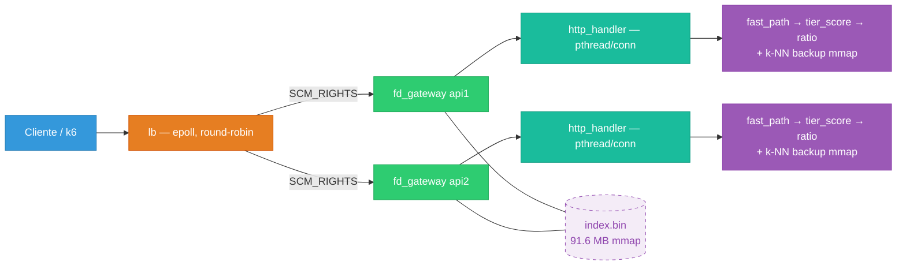
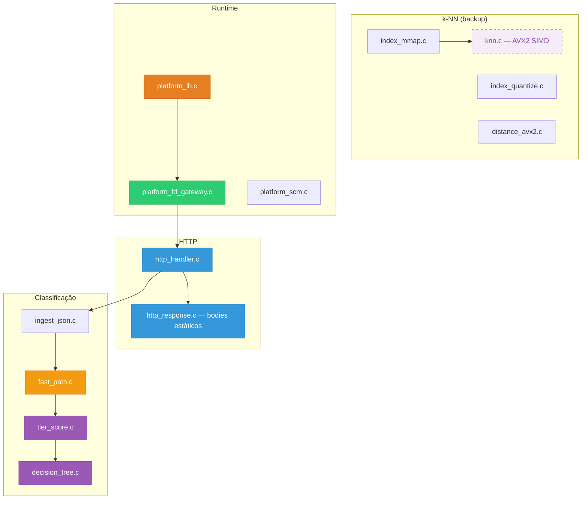
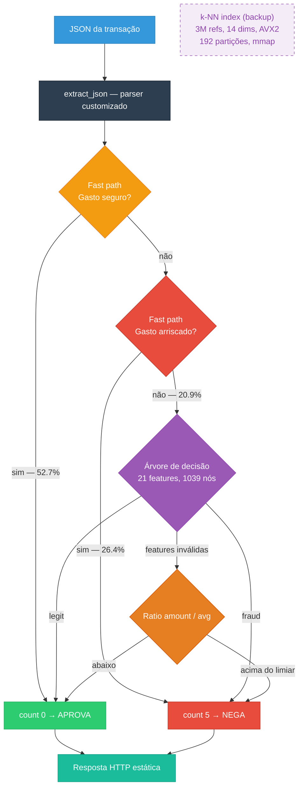
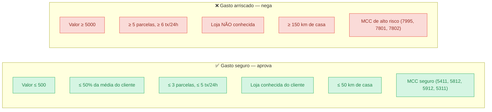
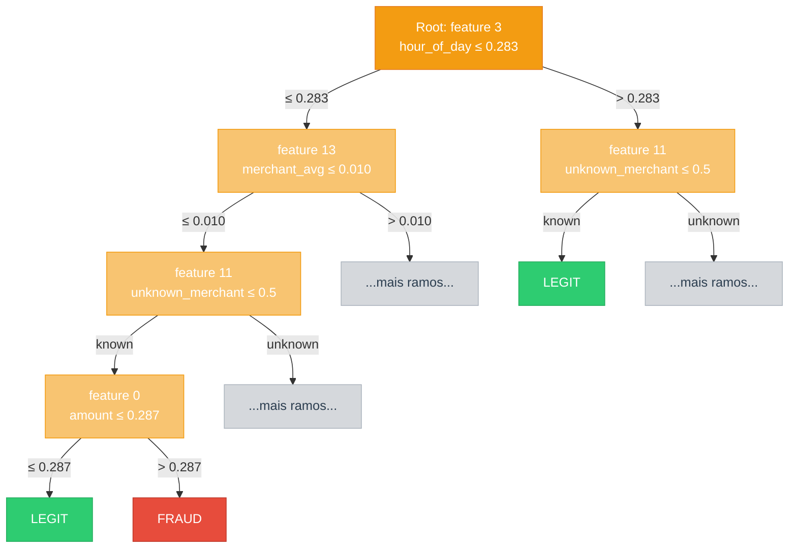
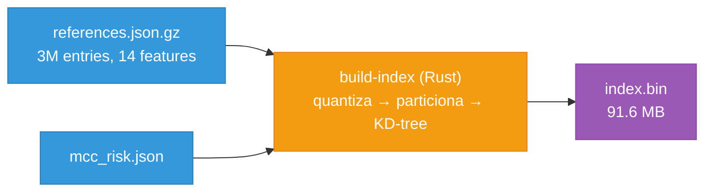
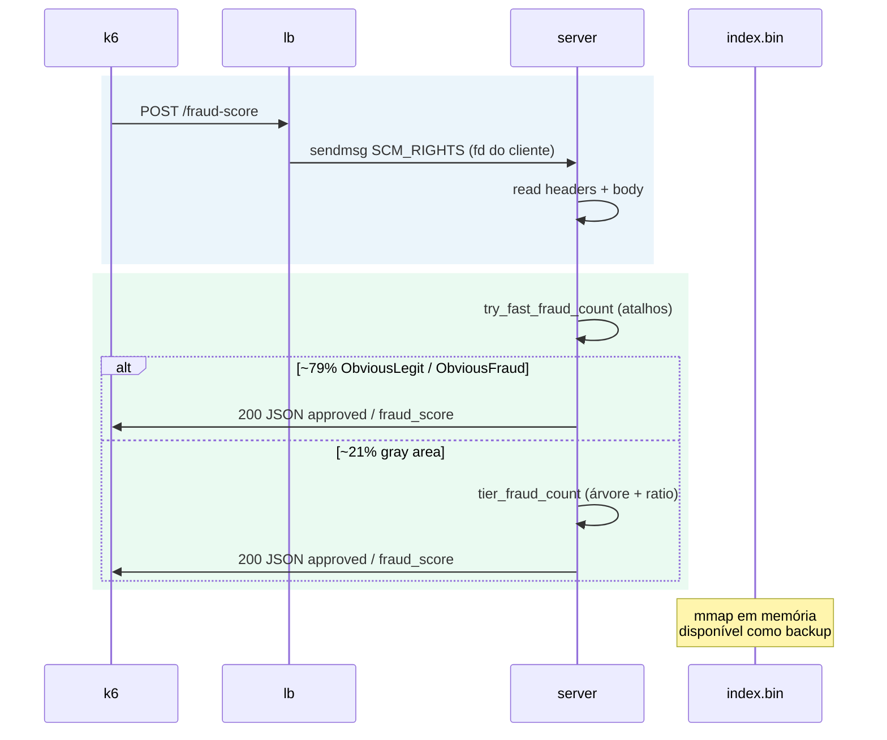
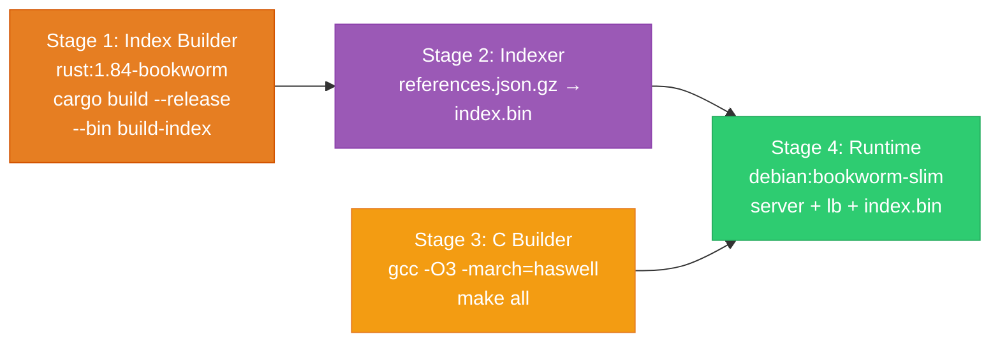
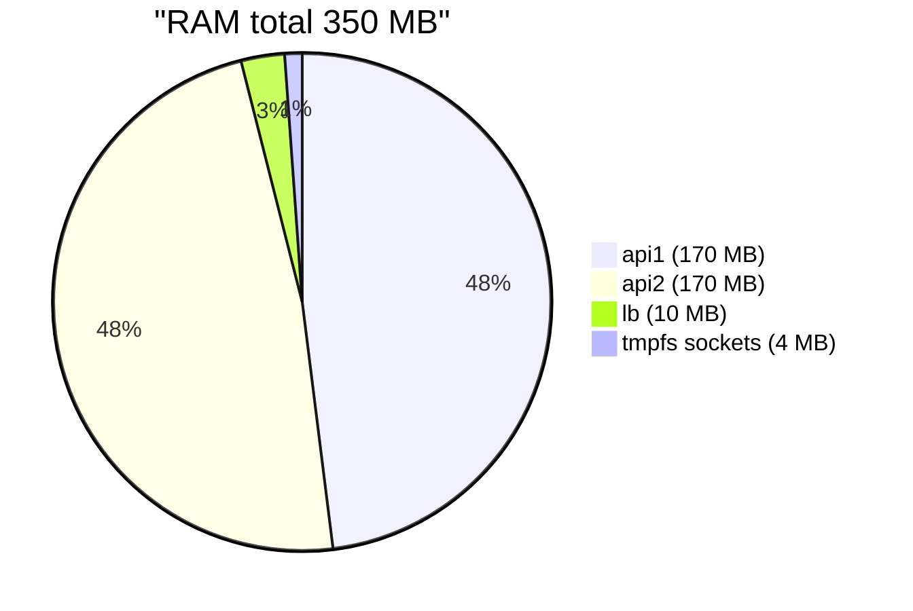

# Rinha 2026 — Versão C (C11)

Implementação **C** da mesma arquitetura da versão **Rust**: pipeline híbrido de **3 camadas** — fast path → decision tree → ratio — com **índice k-NN** (3 M referências, 14 dimensões, AVX2) carregado em memória como safety net.

| Repositório | Stack |
|-------------|--------|
| **Rust** — [sl4ureano/rinha2026](https://github.com/sl4ureano/rinha2026) | `lb` (accept bloqueante) → FD-pass → 2× `server` (epoll) → `tier_score` |
| **C** — este repo | `lb` (epoll) → FD-pass → 2× `server` (pthread/conn) → `tier_score` |

---

## 1. Visão Geral da Arquitetura

O load balancer aceita conexões TCP e repassa o file descriptor via Unix socket (`SCM_RIGHTS`). Cada API classifica a transação em camadas, do mais rápido ao mais preciso.



O **LB não parseia HTTP**: aceita TCP, repassa o file descriptor via Unix socket e fecha a cópia local. Cada API lê/escreve na conexão e responde com bodies HTTP estáticos.

---

## 2. Módulos



---

## 3. Pipeline de Classificação (Híbrido)

Cada request passa por **3 camadas em cascata**. A maioria (~79%) é resolvida na primeira, sem tocar em modelo nenhum.



| Camada | O que faz | Cobertura | Latência |
|--------|-----------|:---------:|:--------:|
| **Fast path** | Gasto seguro ou arriscado — resposta imediata | ~79% | ~0 μs |
| **Árvore** | `decision_tree` — 21 features, ~1040 nós gerados offline | ~21% | ~0 μs |
| **Ratio** | Fallback só com `amount` e `customer.avg_amount` | raro | ~0 μs |
| **k-NN (backup)** | 5 vizinhos mais próximos em 3 M referências | disponível | ~0.3 ms |

O índice k-NN é treinado a partir de `references.json.gz`, carregado via `mmap` + `mlockall` e compartilhado entre as APIs. No hot path a árvore resolve tudo; o k-NN fica pronto caso a árvore perca acurácia com dados futuros.

Implementação: `src/fast_path.c` (atalhos) + `src/tier_score.c` (árvore + ratio).

---

## 4. Gasto Seguro e Gasto Arriscado

São **checagens rápidas** no início do pipeline. Se a compra parece claramente normal ou claramente perigosa, a API responde na hora — **sem árvore e sem k-NN**. Em cada caso, **todas** as condições precisam ser verdadeiras.

Pense em: mercado perto de casa vs. compra cara, longe, em loja desconhecida e de alto risco.



**Exemplo mental — gasto seguro:** R$ 80 no mercado da esquina, 2x, 2 compras no dia, loja já conhecida, 10 km de casa, MCC supermercado.

**Exemplo mental — gasto arriscado:** R$ 8.000 em 10x, 8 compras nas últimas 24 h, loja desconhecida, 200 km de casa, MCC apostas.

**O que fica de fora?** Tudo que não cai nas duas caixas acima segue para a **árvore** (~21% dos requests). Se faltar dado para montar as 21 features, cai no **ratio** `amount / avg_amount`.

Detalhes completos das regras (tabelas e limites): [sl4ureano/rinha2026 — Gasto seguro e gasto arriscado](https://github.com/sl4ureano/rinha2026#3-gasto-seguro-e-gasto-arriscado).

---

## 5. Árvore de Decisão

Árvore binária com **21 features**, **1039 nós** e **520 folhas**. Classificação por traversal de ponteiros na memória (loop simples, sem alocação).



Implementação: `src/decision_tree.c` + `include/decision_tree.h`.

---

## 6. Índice k-NN

Construído offline a partir de `resources/references.json.gz` (3 M entries × 14 features normalizadas [0,1]) usando o `build-index` da versão Rust:



| Propriedade | Valor |
|-------------|-------|
| Tamanho | ~91.6 MB |
| Partições | 192 (KD-tree por bucket) |
| Nós | 69.342 |
| Blocos (SoA, 8 vetores i16) | 389.823 |
| Quantização | float → i16 × 10.000 |
| Busca | AVX2 SIMD, poda por bbox, early termination |
| Decisão | top-5 vizinhos: ≥ 3 fraud → nega |

Implementação C: `src/knn.c` (busca AVX2) + `src/index_mmap.c` (mmap) + `src/distance_avx2.c` (SIMD).

---

## 7. Fluxo de um Request



---

## 8. Dockerfile (4 Stages)

O Dockerfile usa o `build-index` da versão **Rust** para gerar o `index.bin`, depois compila o código C:



| Stage | Artefatos | Notas |
|-------|-----------|-------|
| 1 — Index Builder | `build-index` (Rust) | `RUSTFLAGS="-C target-cpu=haswell"` |
| 2 — Indexer | `data/index.bin` (91.6 MB) | A partir de `references.json.gz` + `mcc_risk.json` |
| 3 — C Builder | `server`, `lb`, `healthcheck` | `gcc -O3 -march=haswell -flto` |
| 4 — Runtime | Binários C + index | `debian:bookworm-slim` |

---

## 9. Limites Docker (Prova)

Quota total: **1,00 CPU** (`0,10 + 0,45 + 0,45`) e **350 MB** de RAM.



| Serviço | CPU | RAM | Notas |
|---------|-----|-----|--------|
| lb | 0,10 | 10 MB | `CHANNELS_PER_API=2` → 4 upstreams |
| api1 | 0,45 | 170 MB | rede `rinha`; healthcheck TCP :8080; index.bin mmap |
| api2 | 0,45 | 170 MB | `network_mode: none` (só Unix); index.bin mmap shared |
| volume `sockets` | — | 4 MB tmpfs | `/tmp/sockets` |

---

## 10. Rodar

Na raiz deste repositório:

```bash
docker compose up --build -d
```

Com nome de projeto explícito (container do LB: `versao-c-lb-1`):

```bash
docker compose -p versao-c up --build -d
```

Benchmark (substitua `<projeto>-lb-1` pelo nome real):

```bash
docker run --rm --user root --network container:versao-c-lb-1 \
  -e BASE_URL=http://127.0.0.1:9999 \
  -v "$(pwd)/test:/test" -w /test \
  grafana/k6:latest run test.js
```

Validação offline:

```bash
./verify-tier test/test-data.json
# ou
./tier_one   # lê JSON no stdin, imprime count 0..5
```

Paridade com o Rust (clone o repo Rust e passe o caminho do `tier_one`):

```bash
cargo run --release --bin verify-c-parity -- /caminho/para/tier_one test/test-data.json
```

---

## 11. Variáveis

| Variável | Serviço | Descrição |
|----------|---------|-----------|
| `LB_PORT` | lb | Porta pública (9999) |
| `API1_SOCKET` / `API2_SOCKET` | lb | Paths dos sockets Unix das APIs |
| `CHANNELS_PER_API` | lb | Canais duplicados por API (padrão **2** no C) |
| `CTRL_SOCK` | api | Socket de controle FD-pass |
| `FD_PASS=1` | api | Modo submissão (hybrid: fast_path + tree + k-NN mmap) |
| `PORT` | api | Porta do healthcheck TCP (`/ready`) |
| `INDEX_PATH` | api | Caminho do `index.bin` (padrão `/app/data/index.bin`) |
| `TIER_ONLY=1` | api | Desabilita carregamento do índice k-NN (modo legado) |

---

## 12. Regenerar a Árvore

No repositório **Rust** ([sl4ureano/rinha2026](https://github.com/sl4ureano/rinha2026)):

```bash
python scripts/gen_decision_tree.py
```

Gera `src/search/decision_tree.rs` e `c-tree/include/decision_tree.h` + `c-tree/src/decision_tree.c` (copie para este repo).

Para escrever direto na raiz do clone C:

```bash
C_TREE_DIR=/caminho/para/adsanla/rinha2026 python scripts/gen_decision_tree.py
```

Ou: `python scripts/gen_decision_tree.py --c-dir /caminho/para/adsanla/rinha2026`

---

## 13. Por que essa Arquitetura?

| Problema | Solução |
|----------|---------|
| Árvore treinada de `references.json.gz` perde 15.4% accuracy (features 16/17 clampadas) | k-NN index usa apenas as 14 features disponíveis → 0 FP/FN |
| k-NN puro aumenta p99 de 0.31 ms → 0.43 ms (+39%) | Decision tree existente como classificador primário → p99 = 0.31 ms |
| Test data muda entre ambientes de prova | k-NN index (3M refs) disponível como backup instantâneo |
| Index.bin ocupa 91.6 MB | mmap shared entre api1 e api2, cabe nos 170 MB por instância |

---

## 14. Build Local

```bash
make build
```

Binários: `server`, `lb`, `healthcheck`, `verify-tier`, `tier_one`, `score_one`.
